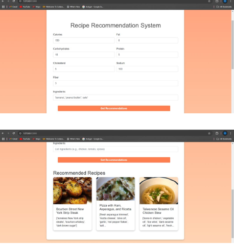

# Recipe Recommendation System using Machine Learning

## Overview
This project is a *Recipe Recommendation System* that suggests recipes based on user input such as nutritional values and ingredients.  
The system uses *Machine Learning and Natural Language Processing techniques* to recommend the most relevant recipes from the dataset.

The application is built using *Flask*, providing an interactive web interface where users can input nutritional information and ingredients to receive recipe suggestions.

---

## Technologies Used
- Python
- Flask
- Pandas
- NumPy
- Scikit-learn
- TF-IDF Vectorization
- K-Nearest Neighbors (KNN)

---

## Features
- Accepts user input for nutritional values and ingredients
- Uses *TF-IDF Vectorization* to process ingredient text data
- Normalizes nutritional features using *StandardScaler*
- Combines text and numerical features for improved recommendations
- Uses *K-Nearest Neighbors algorithm* to find similar recipes
- Displays recommended recipes with ingredients and images

---

## Workflow
1. Load the recipe dataset
2. Preprocess ingredient text using *TF-IDF Vectorizer*
3. Normalize nutritional values using *StandardScaler*
4. Combine numerical and text features
5. Train the *K-Nearest Neighbors model*
6. Accept user input through a Flask web interface
7. Generate and display recipe recommendations

---

## Machine Learning Model Used
- K-Nearest Neighbors (KNN)

---

## Model Output

### Recipe Recommendation System Output

---

## Applications
- Personalized food recommendation
- Diet planning systems
- Smart cooking assistants
- Nutrition-based recipe suggestion platforms

---

## Future Improvements
- Deploy the application as a cloud-based web service
- Improve recommendation accuracy using deep learning models
- Add user authentication and personalized preferences
- Integrate with mobile applications

---

## Author
*Monashree S V*